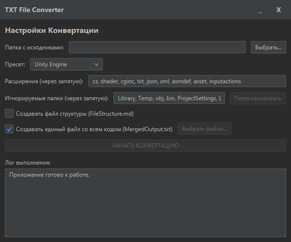

# TxtConverter

Простая и мощная десктопная утилита для безопасного преобразования файлов проекта в формат `.txt`. Идеально подходит для подготовки исходного кода к отправке в текстовые чаты, анализаторами кода или для архивации.



---

## 🔥 Ключевые возможности

*   **Интеллектуальное Сканирование:** Выберите папку проекта, и приложение автоматически найдет все файлы, соответствующие выбранному пресету или вашим настройкам. Есть кнопка "Пересканировать" для обновления списка файлов после изменения критериев.

*   **Гибкий Выбор Файлов:** При создании единого файла (`_MergedOutput.txt`) вы можете нажать кнопку "Выбрать файлы..." и в удобном древовидном меню указать, какие именно файлы включить в отчет полностью.

*   **Безопасная Конвертация:** Приложение НИКОГДА не изменяет исходные файлы. Оно создает копии в отдельной подпапке `_ConvertedToTxt`. Файлы `.md` копируются "как есть", без изменения расширения.

*   **Мощные Пресеты:** Включает готовые наборы настроек для популярных сред разработки. При выборе пресета (например, **Unity Engine** или **Godot Engine**) автоматически заполняются ДВА поля:
    *   Список РАСШИРЕНИЙ файлов для конвертации.
    *   Список ПАПОК для игнорирования (например, `Library`, `target`, `.godot`).

*   **Два Режима Отчетности:** Вы можете включить генерацию полезных итоговых файлов:
    *   **Единый Файл (`_MergedOutput.txt`):** Объединяет содержимое ВСЕХ обработанных файлов в один большой текстовый файл. Файлы, которые вы исключили из отчета, будут помечены специальной заглушкой, но не проигнорированы.
    *   **Структура Проекта (`_FileStructure.md`):** Создает наглядное дерево каталогов, показывающее, какие именно файлы были обработаны.

*   **Современный GUI:** Интуитивно понятный интерфейс, построенный на **JavaFX**, с кастомной темной темой в стиле современных IDE.

*   **Портативность:** Приложение собирается в самодостаточный пакет, который не требует предварительной установки Java на машине пользователя.

## 🚀 Как использовать (для пользователей)

1.  Перейдите в раздел **[Releases](https://github.com/oiuht54/TxtConverter/releases)** на этой странице.
2.  Скачайте последнюю версию приложения (обычно в `.zip` архиве).
3.  Распакуйте архив в любое удобное место.
4.  Запустите `TxtConverter.exe`.
5.  Выберите папку с вашим проектом. Приложение **автоматически просканирует** ее.
6.  Настройте опции: выберите пресет, при необходимости измените списки расширений/папок. Если вы изменили настройки, нажмите **"Пересканировать"**.
7.  Если вы создаете единый файл, вы можете нажать **"Выбрать файлы..."**, чтобы отметить только нужный код для полного включения в отчет.
8.  Нажмите **"НАЧАТЬ КОНВЕРТАЦИЮ"**.

## 🛠️ Как собрать из исходников (для разработчиков)

Если вы хотите внести изменения или собрать приложение самостоятельно, следуйте этим шагам.

### Предварительные требования

*   **JDK 21** (или новее). Убедитесь, что `JAVA_HOME` указывает на директорию JDK.
*   **Apache Maven**. Убедитесь, что `mvn` доступен из вашей командной строки.

### Шаги сборки

1.  **Клонируйте репозиторий:**
    ```sh
    git clone https://github.com/ВАШ_НИК/TxtConverter.git
    cd TxtConverter
    ```

2.  **Запустите сборку с помощью Maven:**
    ```sh
    mvn clean package
    ```
    Эта команда скомпилирует исходный код, создаст один "fat-jar" со всеми зависимостями и упакует его в нативный пакет с помощью `jpackage`.

3.  **Найдите результат:**
    Готовое к запуску приложение будет находиться в директории:
    `target/jpackage/TxtConverter/`

    Внутри вы найдете `TxtConverter.exe` и все необходимые для его работы файлы.

## 💻 Технологический стек

*   **Язык:** Java 21
*   **GUI Framework:** JavaFX 21
*   **Система сборки:** Apache Maven
*   **Плагины сборки:**
    *   `maven-shade-plugin` для создания "fat-jar".
    *   `jpackage-maven-plugin` для создания нативного `.exe`.

## 🤝 Вклад

Если у вас есть идеи по улучшению, не стесняйтесь создавать **Issues** или присылать **Pull Requests**. Любой вклад приветствуется!

---

*Этот проект был создан в сотрудничестве с ИИ-ассистентом.*
