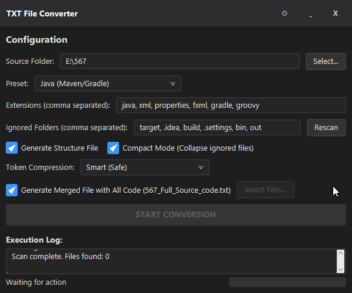
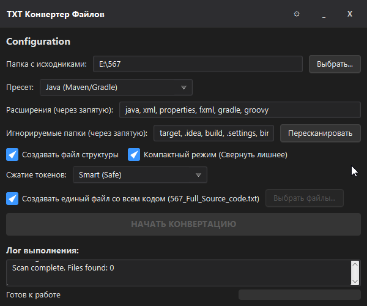

# TxtConverter

[🇷🇺 Читать на русском](#-txtconverter-ru)

**TxtConverter** is a professional desktop utility designed to quickly and safely prepare project source code for analysis by Neural Networks (LLMs), archiving, or sharing in chats.

The application scans your project folder and creates an optimized single text file that is easy to feed into ChatGPT, Claude, DeepSeek, or Gemini.

<!-- Screenshots Side-by-Side -->
<p align="center">
  
  
</p>

---

## 🌍 Multilingual Support
The application fully supports **English** and **Russian** languages.
*   **First Run:** You will be prompted to select your preferred language.
*   **Settings:** You can change the language at any time using the Settings (⚙) menu.
*   **Persistence:** Your choice is saved automatically for future sessions.

---

## 🔥 Key Features

### 🧠 Advanced AI Optimization & Compression
*   **Godot Engine Special Mode (Unique!):**
    *   Includes a specialized parser for `.tscn` and `.tres` files.
    *   Intelligently abbreviates verbose class names (e.g., `MeshInstance3D` → `Mesh`, `CollisionShape3D` → `ColShape`).
    *   Groups repetitive nodes (e.g., `Tree_01` ... `Tree_50` → `@Repeated(50) "Mesh"`).
    *   **Result:** Reduces file size in tokens by **70-75%** while keeping the full logic understandable for LLMs.
*   **General Token Compression:**
    *   **Smart:** Removes excessive empty lines to save vertical space.
    *   **Maximum:** Removes all comments (`//`, `/*`, `#`) and formatting, turning code into a flat list of commands to maximize context window efficiency.
*   **Smart Merging:** You can choose which files to include **fully** and which to keep as **stubs**.
    *   *Example:* If a file is found but not selected for merging, the report will contain: `(File content omitted for brevity...)`. This gives the AI context about the file's existence without wasting tokens.

### 🚀 Smart Automation & UX
*   **Drag & Drop:** Simply drag your project folder into the application window to start.
*   **Auto-Detection:** The app automatically analyzes project files (e.g., `package.json`, `pom.xml`, `project.godot`) and selects the correct Preset for you.
*   **Smart Persistence:** The app remembers your last used folder, settings, and window position.

### ⚡ Performance & Safety
*   **Turbo Scanning:** Optimized algorithm (`walkFileTree`) instantly skips massive ignored folders (like `node_modules` or `.git`), making scanning 100x faster for Web/Node.js projects.
*   **Non-Destructive:** The app **never** modifies your source files. All results are saved in a separate `_ConvertedToTxt` folder inside your project.

### ⚙️ Flexibility
*   **Presets:** Ready-made settings for:
    *   **Godot Engine** (with dedicated .tscn optimizer)
    *   **Unity Engine**
    *   **Java (Maven/Gradle)**
    *   **Web (TypeScript/React)** / **Web (JavaScript/Legacy)**
    *   **Python**
*   **Structure Map:** Optional generation of a `_FileStructure.md` file (Tree or Flat list).

---

## 🚀 How to Use

1.  Run `TxtConverter.exe`.
2.  (First time only) Select your language.
3.  **Drag & Drop** your project folder into the window (or click "Select...").
4.  The app will try to **Auto-Detect** the preset. If needed, change it manually.
5.  Select **"Maximum"** compression level to enable the Godot optimizer (if using a Godot project).
6.  Click **"Rescan"** (if not triggered automatically).
7.  (Optional) Click **"Select Files..."** to check only the scripts you need in full.
8.  Click the big blue button **"START CONVERSION"**.
9.  Once done, check the created `_ConvertedToTxt` folder.

---

## 🛠️ Build from Source

The project is built on **Java 21** and **JavaFX 21**.

### Requirements
*   JDK 21+
*   Apache Maven

### Build Commands

```bash
mvn clean package
```
The ready-to-use application will be in: `target/jpackage/TxtConverter/`

---

<br>
<br>

# 🇷🇺 TxtConverter (RU)

**TxtConverter** — это профессиональная десктопная утилита для быстрой и безопасной подготовки исходного кода проектов к анализу нейросетями (LLM), архивации или отправке в чаты.

Приложение сканирует папку проекта и создает оптимизированный единый текстовый файл, который удобно "скармливать" ChatGPT, Claude, Gemini или DeepSeek.

---

## 🌍 Мультиязычность
Приложение полностью поддерживает **Русский** и **Английский** языки.
*   **Память:** Ваш выбор языка и настроек сохраняется автоматически.

---

## 🔥 Ключевые возможности

### 🧠 Продвинутая оптимизация для LLM (ИИ)
*   **Специальный режим Godot Engine (Эксклюзив!):**
    *   Встроенный парсер для `.tscn` и `.tres` файлов.
    *   Умно сокращает длинные имена классов (напр., `MeshInstance3D` → `Mesh`, `NavigationAgent3D` → `NavAgent`).
    *   Группирует сотни повторяющихся объектов в одну строку (напр., `@Repeated(50) "StaticBody"`).
    *   **Результат:** Экономия токенов достигает **70-75%**, сохраняя при этом логику сцены понятной для нейросети.
*   **Сжатие токенов:**
    *   **Умное:** Удаляет лишние пустые строки.
    *   **Максимум:** Удаляет комментарии и форматирование, максимально экономя контекст.
*   **Умное слияние:** Выбор файлов, которые нужны **полностью**, и файлов, которые нужны только как **заглушки** (для контекста).

### 🚀 Автоматизация и Удобство
*   **Drag & Drop:** Просто перетащите папку проекта в окно программы.
*   **Авто-определение:** Приложение само находит ключевые файлы (`project.godot`, `pom.xml`, `package.json` и др.) и выставляет нужный пресет.
*   **Сохранение настроек:** Программа запоминает последнюю папку, пресет и галочки настроек.

### ⚡ Производительность
*   **Турбо-сканирование:** Новый алгоритм мгновенно пропускает тяжелые папки (вроде `node_modules`), ускоряя работу с Web-проектами в сотни раз.
*   **Безопасность:** Результаты сохраняются в отдельную папку `_ConvertedToTxt`, исходники не затрагиваются.

### ⚙️ Пресеты
*   **GameDev:** Unity, Godot (с оптимизатором сцен).
*   **Web:** TypeScript (Modern), JavaScript (Classic).
*   **Backend:** Java, Python.

---

## 🚀 Как использовать

1.  Запустите `TxtConverter.exe`.
2.  **Перетащите папку** проекта в окно (или нажмите "Выбрать...").
3.  Приложение автоматически определит тип проекта (Пресет).
4.  Для Godot-проектов выберите уровень сжатия **"Максимум"**, чтобы включить умный парсер сцен.
5.  Нажмите **"Начать конвертацию"**.
6.  Заберите готовый файл в папке `_ConvertedToTxt`.

---

*TxtConverter — Making AI coding easier.*
